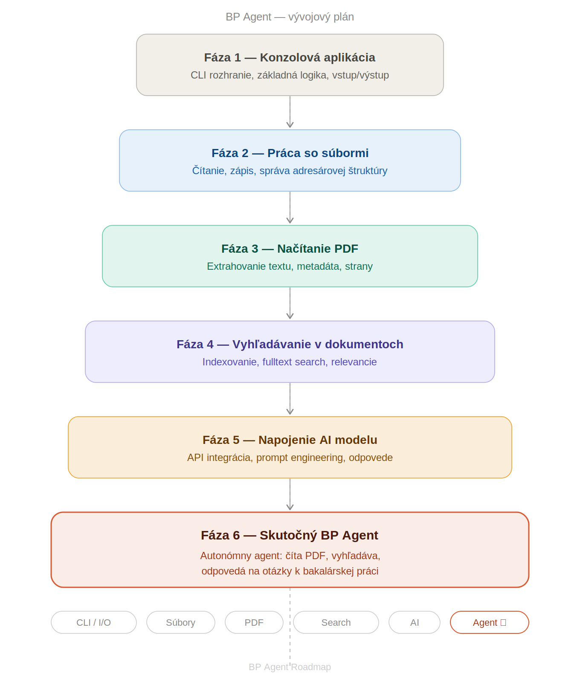

# Zaznamnik

## 2026-06-13

### Nadstavenie projektu

- vytvorenie github repozitara
- lokalne naklonovanie repozitara
- instalacia pythonu 3.13
- vytvorenie virtualneho prostredia (.venv)
- vytvorenie python suboru (main.py)

### Poznamky

- venv je modul, ktory vytvori izolovane python prostredie pre jeden konkretny projekt, aby sa kniznice a nastavenia jednotlivych projektov navzajom neovplyvnovali
- Path() sluzi na pracu s cestami, kde chceme nieco hladat
- file.suffix umoznuje zistit typ suboru
- enumerate() na ziskanie cisla riadku
- pouzitie kniznice pypdf
- 

### Architektura projektu

 - vytvorenie agenta, ktory bude pomahat pri tvorbe bakalarskej prace

 #### Funkcionality
 - odpovedat na otazky nad PDF dokumentmi
 - sumarizovat odborne clanky
 - vyhladavat informacie v nahranych zdrojoch - filtrovanie podla formatov
 - pomahat s tvorbou osnovy bakalarskej prace
 - navrhovat otazky na obhajobu
 - upozornovat na chybajuce citacie
 - vysvetlovat odborne pojmy

 #### Casti systemu

 - uzivatelske rozhranie
    - tu prebieha komunikacia s agentom, uzivatel zadava otazky, agent mu dava odpovede 
 - logika agenta
    - spracovanie poziadaviek od uzivatela
    - rozhodne sa, ake kroky vykona
    - komunikuje s uzivatelom
 - cerpanie informacii
    - obsahuje vlozene pdf, clanky, poznamky, zdroje z ktorych vyhladava odpovede
- AI model
    - generuje odpovede na zaklade vyhladanych informacii zo zdrojov
    - pomaha s analyzou, sumarizaciou a vysvetlovanim obsahu

#### Tok dat

- pouzivatel -> UI -> logika agenta -> zdroje agenta -> AI model -> vysledna odpoved uzivatelovi

#### Roadmap

### Problemy a riesenia

#### Aktivacia virtualneho prostredia

Problem:
PowerShell odmietol spustit Activate.ps1.

Riesenie:
Set-ExecutionPolicy -ExecutionPolicy RemoteSigned -Scope CurrentUser

### Dokoncene

- vytvorenie hlavneho menu
- nacitanie dokumentov z priecinka
- filtrovanie dokumentov
- vyber konkretneho dokumentu
- zobrazenie obsahu dokumentu
- podpora pdf dokumentov
- vyhladavanie vyrazu v dokumentoch
- zobrazenie cisla riadku s najdenym vyrazom

